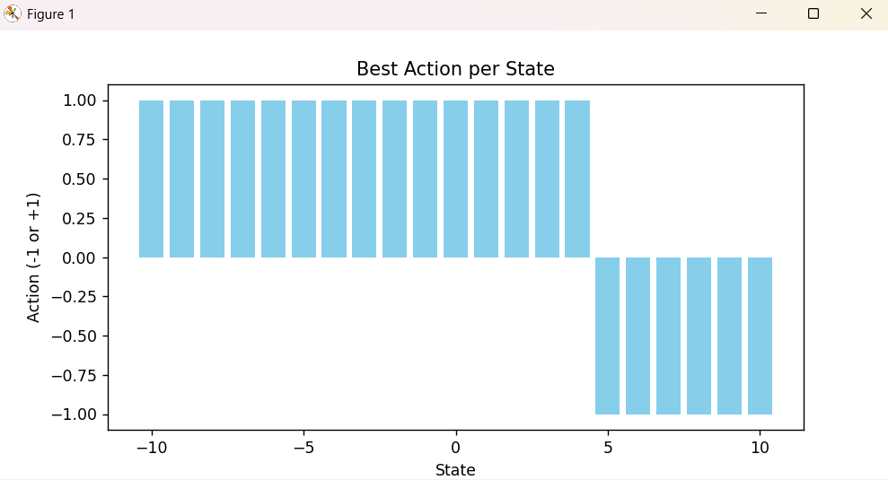

# 1D Q-Learning Game

This is a simple 1D reinforcement learning environment where an agent learns to move toward a goal state using **Q-learning**. The environment consists of discrete states along a line, and the agent can move **left (-1)** or **right (+1)** each step.

---

## Environment

* **States:** Discrete positions from -10 to 10.
* **Actions:** Move left (-1) or move right (+1).
* **Goal:** Reach a target state (default: 5).
* **Rewards:**

  * +10 for reaching the goal.
  * +1 for moving closer to the goal.
  * -8 for moving away from the goal.
  * -10 for hitting the boundry
* **Episode ends** when the agent reaches the goal.

---

## Agent

* Implements **Q-learning** to learn the optimal action for each state.
* Uses an **epsilon-greedy policy** to balance exploration and exploitation.
* Updates a **Q-table** representing expected cumulative rewards for each state-action pair.

---

## How to Run

1. Train the agent using:

```bash
python myversion.py
```

2. After training, the Q-table is visualized:

* **Heatmap of Q-values** shows the learned value for each state-action pair:
  

* **Best action per state** bar chart shows the preferred action for each state:
  

---

## Files

* `numberLine.py` — Main environment and agent implementation, training loop, and visualization.
* `README.md` — Overview and usage instructions.

---

## Dependencies

* Python 3.x
* `numpy`
* `matplotlib`
* `seaborn`

---

